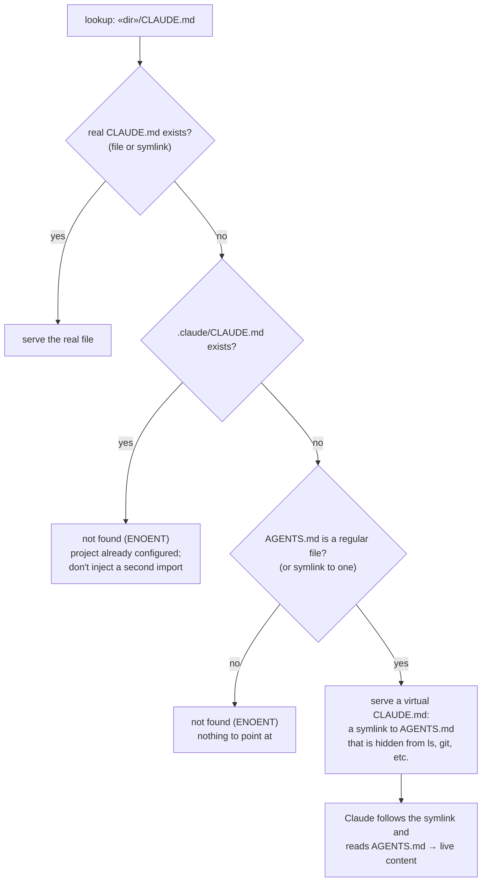

> [!TIP]
> This is a meme project but please enjoy it if you find it useful!

# ClaudelessFS

A macOS file system extension that makes virtual `CLAUDE.md` files and helps Claude Code work with any agent-friendly project that contains `AGENTS.md` but might not have `CLAUDE.md`.

This extension automates Anthropic's official [documentation](https://code.claude.com/docs/en/memory#agents-md):

> Claude Code reads `CLAUDE.md`, not `AGENTS.md`. If your repository already uses `AGENTS.md` for other coding agents, create a `CLAUDE.md` that imports it so both tools read the same instructions without duplicating them.
>
> A symlink also works if you don't need to add Claude-specific content:
>
> ```bash
> ln -s AGENTS.md CLAUDE.md
> ```

ClaudelessFS provides exactly that symlink — in every directory that needs one, visible only to programs that ask for `CLAUDE.md` by name, with nothing added to your repositories. It's smart about when to provide the virtual file and is designed to work well with how Claude Code looks up your custom instructions.

## The rule

A directory gets a virtual `CLAUDE.md` when these three conditions are true:

1. It has no real `CLAUDE.md`.
2. It has no `.claude/CLAUDE.md`.
3. It has an `AGENTS.md` (a regular file, or a symlink to one).

> [!NOTE]
> ClaudelessFS checks these rules whenever a program like Claude Code tries to read `CLAUDE.md`. This way, your agent instructions stay correct if you add or remove `CLAUDE.md` or `AGENTS.md` files. It just works.



Note that `.claude/rules/*.md` and `CLAUDE.local.md` don't block the directory from getting a virtual `CLAUDE.md` file. This is on purpose because the "rules" files are meant to be additive, and  `CLAUDE.local.md` is personal, gitignored state.

## The virtual file is invisible in directory listings

Virtual `CLAUDE.md` files never appear in `ls`, `git status`, or macOS Finder. This is so tools like Git don't commit it to your repository.

However, Claude Code can see it because it reads the exact file path instead of listing the directory's contents.

## Install

Requires macOS 26 on Apple Silicon. Download `ClaudelessFS.zip` from the [latest release](https://github.com/ide/ClaudelessFS/releases/latest), then:

```sh
unzip ClaudelessFS.zip
mv ClaudelessFS.app /Applications/
/Applications/ClaudelessFS.app/Contents/MacOS/ClaudelessFS setup
```

The app is notarized, so macOS runs it as is. `setup` links the `claudelessfs` command onto your PATH, enables the file system extension, and restarts `fskitd` (asks for sudo once).

To uninstall, run `claudelessfs uninstall`. It unmounts everything, disables the extension, and removes the app and the `claudelessfs` command.

This extension is built with [FSKit](https://developer.apple.com/documentation/fskit) and runs in user space.

## How to use it

```sh
claudelessfs mount ~/Developer          # enable for a given directory
claudelessfs mount /src /mnt            # or serve at another path
claudelessfs status                     # module state + active mounts
claudelessfs unmount ~/Developer        # or: claudelessfs unmount all
claudelessfs enable | disable           # FSKit module on/off
```

Plain `mount`/`umount` work too:

```sh
mount -F -t claudelessfs ~/Developer ~/Developer
umount ~/Developer
```

## What works

- Full read-write passthrough: create, write, rename, remove, symlinks, hardlinks, chmod/chown/truncate/utimes, xattrs.
- Renaming a directory keeps everything under it working — open file descriptors, shells with their cwd inside it, and virtual CLAUDE.md files all follow the rename.
- Open files hold a real fd, so POSIX open-time permission rules hold and git can write its read-only loose objects.
- xattrs pass through, so macOS doesn't scatter `._` AppleDouble files.
- The virtual file is a symlink, so writing "through" it edits AGENTS.md — the same behavior as a real `ln -s AGENTS.md CLAUDE.md`. Deleting or renaming the virtual file itself is refused, with an error that says why and what to do instead. Creating a real CLAUDE.md (or renaming one into place) works and stops synthesis.
- Refused mounts fail with a reason and a fix, printed by `mount` itself. Refused: `/`, your home directory, system directories, non-directories.
- If the extension dies, the mount dissolves and the real files are fine. If a mount ever gets stuck, run: `pkill -f ClaudelessFSExtension`.

## Performance

These are benchmarks from a M4 Mac on macOS 26.5 comparing identical trees on plain APFS vs through a ClaudelessFS mount. "Warm" means the kernel answered from its name, attribute, or page cache without calling the extension, which is the steady state for objects accessed more than once.

| operation | plain APFS | through mount | overhead |
|---|---|---|---|
| stat a file, warm | 1.2 µs | 0.4–2.6 µs | none |
| stat the virtual CLAUDE.md | — | 2.7 µs | — |
| open + read 1 KB + close | 5.4 µs | 5.1 µs | none |
| read 64 KB, warm | 2.8 µs | 3.1 µs | ~10% |
| sequential read, warm | 17.5 GB/s | 12.1 GB/s | streaming only |
| write throughput | 234 MB/s | 287–430 MB/s | none |
| stat a missing name, repeated | 0.5 µs | 0.4 µs | none |
| stat a missing name, first time | 1.9 µs | 51–60 µs | ~30× once |
| first lookup of any file | ~1 µs | ~50 µs | ~50× once |
| list 1000 entries, cold | 0.38 ms | 2.2 ms | ~6× |
| create a file | ~30 µs | ~7.8 ms | ~260× |
| delete a file | ~26 µs | ~5.4 ms | ~200× |
| rename a file | ~30 µs | ~8.9 ms | ~300× |

What this means:

- **Reads are effectively free.** Warm stats, opens, and reads run at native speed. The kernel handles opening files (open/close upcalls are disabled), and repeated data reads come from the page cache. Warm `grep -r` over 2,000 files performs similar to plain APFS (0.05 s vs 0.04 s).
- **One-time overhead per file**: ~50 µs on the first lookup, then it's cached.
- **Mutations are expensive.** Every create, delete, and rename costs 5–9 ms: macOS turns each one into ~10 kernel↔extension round trips (lookups, attribute reads, and provenance-xattr writes on new files). `git add && git commit` of 2,000 new files: 2.2 s vs 0.16 s raw.

Rule of thumb: editing, building, and running Claude Code under a mount are fine. Run `npm install`, large clones, or `rm -rf` of big trees outside the mount. Unmounting to do this work and remounting later is fast.

## Freshness

The virtual `CLAUDE.md` is a symlink to `AGENTS.md`, a virtual version of the `ln -s AGENTS.md CLAUDE.md` that Anthropic's docs recommend. These are the delays between a change and the virtual file reflecting it (all through the mount):

| change | takes effect in |
|---|---|
| AGENTS.md created → virtual CLAUDE.md appears | < 1 ms |
| AGENTS.md deleted → virtual CLAUDE.md gone | < 1 ms |
| real CLAUDE.md created → real file wins | < 1 ms |
| .claude/CLAUDE.md deleted → virtual returns | ~20 ms |
| .claude/CLAUDE.md created → virtual withdraws | ~20 ms |

For the last two: macOS remembers lookup answers (the virtual `CLAUDE.md` it served, or the "file not found" it reported) and normally reuses them without asking ClaudelessFS again, potentially forever; there is no API to clear macOS's filesystem cache. However, certain file operations make macOS forget its remembered answers for a specific file, so whenever `.claude/CLAUDE.md` is created or deleted, ClaudelessFS immediately performs an invisible, no-op file operation in the project's directory so that macOS will ask ClaudelessFS about the existence of `CLAUDE.md` the next time a program asks for this file.

## Known limitations

- Covering `/` is impossible (macOS seals the system volume), and covering your home directory is disallowed (a crash would hang your session).

## Building from source

`scripts/install.sh` runs the whole pipeline: generate the Xcode project, build, notarize, staple, install, and enable. It needs Xcode 26, `xcodegen`, an Apple Developer account (the FSKit entitlement requires a provisioning profile), and a `notarytool` keychain profile. Set `TEAM_ID` and `NOTARY_PROFILE` to yours. `scripts/uninstall.sh` reverses everything.

## Releasing

`scripts/release.sh <version>` cuts a release on demand: it sets the version in `project.yml`, builds and notarizes (`scripts/build.sh`, shared with `install.sh`), verifies the stapled app against Gatekeeper, then commits the version bump, tags `v<version>`, pushes, and publishes a GitHub release with the notarized `ClaudelessFS.zip` and its SHA-256. Run it from a clean checkout of `main`; it also needs an authenticated `gh`. Nothing is pushed until notarization succeeds, and a failed run leaves the tree clean.
